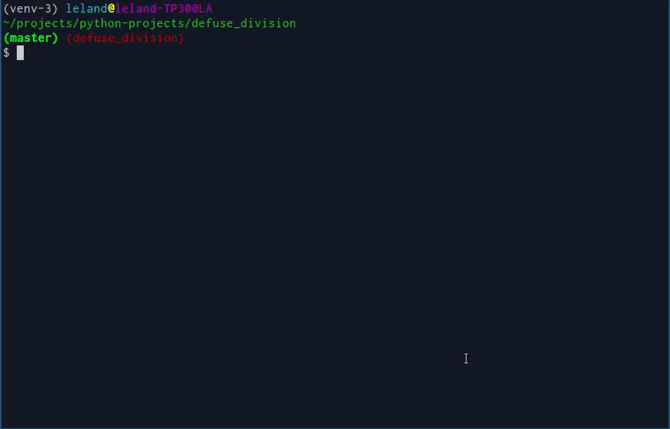

===============
Defuse Division
===============

Defuse Division is a real-time competitive multiplayer implementation of the
game Minesweeper that you can play in your terminal. Defuse Division is written
entirely in Python3.

Table of Contents
=================

.. contents::
    :backlinks: none

Installation
============

Install with Pip
----------------

To install and play, run::

    pip install defusedivision
    defusedivision # Starts the game

Play from source
----------------

Alternatively, you can clone this repository and run the ``play-defusedivision``
file in this repository (which works in the same way as the ``defusedivision``
command which is installed when you install via pip)::

    git clone "https://github.com/lelandbatey/defuse_division"
    cd defuse_division
    ./play-defusedivision

Multiplayer
===========

If you want to play head to head against multiple people, you have two options:

Run a dedicated server
----------------------

You can run a dedicated server with the command::

    defusedivision --serveronly

This will launch a dedicated DefuseDivision server on port 44444. You can
customize the port and interface with the ``--port`` and ``--host`` command line
arguments.

Host a server while playing
---------------------------

You can play and host a server for other people to play on by selecting the
option in the main menu labeled 'Host and play'. This will launch a game server
on port 44444 on your machine exposed on all interfaces and connect to that
server. This server will also use Zeroconf/mDNS to advertise itself on the
local network, so other people on the same network as you will see your server
in the box labeled 'Local Servers' under the 'Multiplayer' menu.

Prerequisites
=============

DefuseDivision is a terminal based game leveraging some semi-specialized
features of terminal emulators. Some terminal emulators don't support the
necessary features, and will break or not run. For example, ``PuTTY`` on Windows
works very poorly with this game.

The actual requirements are:

- Unicode support
    - Specialized unicode characters are used to draw certain elements of the game, and will display as missing characters like "�" or "□" if your terminal doesn't support them
- Color terminal support
    - If your terminal doesn't support colors, hopefully it will display an error explaining what's happened, but the game may simply crash or refuse to run.

Environments known to work with the base game (without sound)
-------------------------------------------------------------

I've tested DefuseDivision on the following platforms/terminal emulators and found them to work with the base game:

===================  =======================  =============================
Operating System     Terminal Emulator        ``TERM`` Environment Variable
===================  =======================  =============================
Ubuntu 16.04.1 LTS   rxvt-unicode-256color    rxvt-unicode-256color
Ubuntu 16.04.1 LTS   gnome-terminal           xterm-256color
Ubuntu 16.04.1 LTS   xfce4-terminal           xterm-256color
===================  =======================  =============================

Getting sound to work
---------------------

DefuseDivision can try to play sounds with the ``--withsound`` command line
argument. Sound is played through the ``pygame`` library, if it is installed. If
``pygame`` is not installed, sound will not be played, even if the ``--withsound``
argument is passed.

On my Linux installation, to enable playing sound through ``pygame``, I had to
set the environment variable ``SDL_AUDIODRIVER`` to the value ``alsa`` (but
when I did so, CPU usage spiked markedly). If sound is not working, or sound is
playing very erratically (such as crackling, static-like crunching noises while
audio plays), you probably need to install the ``libsdl1.2`` libraries. To
install on Ubuntu, I installed like so::

    sudo apt install libsdl1.2-dev libsdl-image1.2-dev libsdl-mixer1.2-dev libsdl-ttf2.0-dev

Sound has not been tested on any system other than Linux.

Command Line Arguments
----------------------

::

    usage: defusedivision [-h] [--height HEIGHT] [--width WIDTH] [--mines MINES]
                          [--debug] [--vimkeys] [--maxsize] [--withsound]
                          [--playername PLAYERNAME] [--host HOST] [--port PORT]
                          [--serveronly]

    Play a game of minesweeper. Use arrows to move, 'enter' or 'space' to probe,
    'f' to flag, CTRL-C to exit.

    optional arguments:
      -h, --help            show this help message and exit
      --height HEIGHT       the height of the board (default=16)
      --width WIDTH         the height of the board (default=16)
      --mines MINES         number of mines on the board
      --debug
      --vimkeys             allows vim control keys while playing game (HJKL for
                            move, space to probe)
      --maxsize             makes game use largest minefield that fits on your
                            screen
      --withsound           if passed, attempts to use sound
      --playername PLAYERNAME
                            name of your player
      --host HOST           remote host to connect to
      --port PORT           port of remote host
      --serveronly          if true, run as dedicated server

Of these commands, the ``--height``, ``--width``, ``--mines``, ``--maxsize``,
and ``--playername`` options will affect both remote and local games. This is
intentional, to allow you to run mulitplayer games with whatever settings you
like, but it may allow a stranger to do stupid stuff or even crash your game.

Known Bugs
----------

1. If you hold down a direction key on the main menu for an indeterminate amount of time, eventually curses will start corrupting the contents of the screen.
    - This is a result of the concurrent way input and display updating are are handled in this program, specifically it happens because calling ``getch`` on a window object also causes that window to be refreshed, and since input and updating are handled concurrently, very occasionally ``getch`` is called while the window is already refreshing, causing two refreshes of the window object to happen simultaneously, causing some corruption of the screen. This can only be solved by transitioning to using ``curses.pad`` objects instead of ``curses.window`` objects, but the bug is so intermittent that I haven't done it yet for the menus, though the fix has been implemented for the in-game display.
2. The ``--vimkeys`` option doesn't enable vim control keys in the menus
    - That's broken since the menus are using a hardcoded set of keys for movement and selection, instead of the more abstract movement used while actually playing a game of minesweeper. I'll get around it implementing that one day
3. It's possible to crash another players client by connecting to a server with a ``--height`` and ``--width`` that is so large it causes curses to attempt to draw out of bounds characters
4. It's possible to crash a server by connecting with a ``--mines`` number set higher than the number of cells in the minefield.
5. The ``--playername`` argument allows users to have names that are really long and which include newlines, which could be abused

